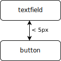

Layout expectations
===================

## General Concept
An expectation starts with `Expectations.expect(items)` where `items` may be a single item or multiple items. According to this choice there are different constraints that can be applied.

The number of items involved in such a constraint is stated in parentheses after the constraint name. These may be

- one item - (1)
- one item in relation to another - (2)
- multiple items in relation to each other - (*)

## Distances (2)

### At
`at()` allows to specify the relative position of two items.

Specify which distance you expect between two items.

    expect(textfield)
      .at().greater(5).pixels()
      .of(button);

Specify the horizontal direction you expect another item.

    expect(textfield)
      .at().left().about(10).pixels()
      .of(button);

Specify the vertical direction you expect another item.

    expect(textfield)
      .at().top().less(5).pixels()
      .of(button);

### Above and Below
`above()` and `below()` are shortcuts for `at().top()` and `at().bottom()` and thus specify the relative vertical position of two items.

Specify the vertical relation between two items.

    expect(caption)
      .above().between(10).and(20).pixels()
      .of(description);

    expect(description)
      .below().between(10).and(20).pixels()
      .of(caption);

### Right and Left
`left()` and `right()` are shortcuts for `at().left()` and `at().right()` and thus specify the relative horizontal position of two items.

Specify the horizontal relation between two items.

    expect(textfield)
      .left().about(10).pixels()
      .of(button);

    expect(button)
      .right().about(10).pixels()
      .of(textfield);

## Alignment (2, *)
`alignedHorizontally()` and `alignedVertically()` allows to specify the alignment of two items.

### Horizontal
`alignedHorizontally()` can be specified to align different edges
* `top()`
* `bottom()`
* `centered()`
* `all()`

Specify horizontal alignment at top and bottom (all) for all selected items.

    expect(item1, item2, item3)
      .alignedHorizontally().all()
      .withEachOther();

Specify horizontal alignment to the top line for all selected items.

    expect(item1, item2, item3)
      .alignedHorizontally().top()
      .withEachOther();

Specify horizontal alignment to the middle relative to another item.

    expect(item1)
      .alignedHorizontally().centered()
      .with(item2);

### Vertical
`alignedVertically()` can be specified to align different edges
* `right()`
* `left()`
* `centered()`
* `all()`

Specify vertical alignment to the left line for all selected items.

    expect(item1, item2, item3)
      .alignedVertically().left()
      .withEachOther();

Specify vertical alignment to left and right relative to another item.

    expect(item1)
      .alignedVertically().all()
      .with(item2);

Specify vertical alignment to the right line for all selected items and enforce equal distance.

    expect(item1, item2, item3)
      .alignedVertically().right()
      .equallyDistanced()
      .withEachOther();

## Containment (2)
`inside()`,`contains` and `overlaps` allow to specify the relative overlapping of two items.

### Inside
`inside()` specifies that the subject shape is inside the object shape

Specify the top offset of an inside object

    expect(button)
      .inside().about(20).pixels().top()
      .of(container);

### Contains
`inside()` specifies that the subject shape is containing the object shape

Specify the top offset of multiple contained objects

    expect(container)
      .contains().about(20).pixels().top()
      .items(item1, item2);

Specify the custom offsets of multiple contained objects

    expect(container)
      .contains()
      .about(20).pixels().top()
      .about(20).pixels().bottom()
      .about(10).pixels().left()
      .about(10).pixels().right()
      .items(item1, item2);

### Overlaps
`overlaps()` specifies that the subject shape is overlapping the object shape

Specify two objects overlapping

    expect(text)
      .overlaps().about(10).pixels().top()
      .with(image);

## Layers (2)
`behind()` and `front()` allow to specify the relative position in the stack of shapes.

### Behind and Front
`behind()` specifies that the subject is behind the object. The subject may be (partially) hidden by the object.
`front()` specifies that the subject is in front of the object. The object may be (partially) hidden by the subject.

Specify on object to be visible and the other to be partially hidden

    expect(image)
      .behind()
      .of(description);
    expect(description)
      .front()
      .of(image);

## Size (1, 2)
`width()` and `height()` allow to specify absolute or relative size of a shape.

### Height
`height()` specifies the height of a shape, either absolute or relative to another.

Specify the absolute height of an shape

    expect(button)
      .height().equal(25).pixels();

### Width
`width()` specifies the width of a shape, either absolute or relative to another.

Specify the width of an object relative to another

    expect(text)
      .width().equal(200).percentOf(image);

## Visibility (1, *)
`isAbsent()` and `isPresent()` (`areAbsent()` and `arePresent()`) allow to specify whether a shape is visible to the user or not. 

A share is absent, if

- it is not in the dom
- it is of style `display:none`
- it is of style `visibility:hidden` or `visibility:collapse`
- it has no width or no height
- it is completely transparent
- it is outside the viewable area
- it is inside a parent that is absent

### Absent
`isAbsent()` and `areAbsent()` allow specifying that an item or some items are not visible to the viewer.

    expect(comments)
      .isAbsent();

### Present
`isPresent()` and `arePresent()` allow specifying that an item or some items are visible to the viewer.

    expect(comments)
      .isPresent();

## Text (1)
`text()` allows to specify contents in text. 

### equalTo
`contains()` specifies the exact text content

    expect(button)
      .text().equals("Ok")

### contains
`contains()` specifies which phrases should be contained in the text

Expect the element to contain some key words

    expect(column)
      .text().contains("important")
      
### contains
`containsNot()` specifies which phrases should not be contained in the text

Expect the element not containing dummy text

    expect(column)
      .text().containsNot("Lorem Ipsum")

### startsWith
`startsWith()` specifies the prefix of the text

Specify an element to start with a certain text

    expect(fairyTale)
      .text().startsWith("Once upon a time")

### endsWith
`endsWith()` specifies the suffix of the text

Specify an element to end with a certain text

    expect(sentence)
      .text().endsWith(".")

## Collection Properties (*)

### Count
`count()` allows the number of items that where captured in a variable

    expect(items)
      .width().count().equal(4);

## Single Properties (1)

### effectiveStyle
`effectiveStyle()` allows allows to specify certain effective (computed) css properties. 

    expect(item1)
      .effectiveStyle()
      .attribute("font-size").is("18px");
    expect(item1)
      .effectiveStyle()
      .attribute("font-family").contains("Helvetica");

## Collection Processing (1,*)

### Each
`each()` allows allows to specify constraints on each element of the collection.

Specify that each item has a certain height

    expect(items)
      .each(item -> item.height().equal(20).pixels());
 
### Select
`select()` allows allows to specify constraints on a sub collection of the collection.

Specify that each div item has a certain height

    expect(items)
      .select(
        i -> i.findElement(tagName("div")),
        is -> is.each(item -> item.height().equal(20).pixels()));

### Sorted
`sorted()` allows to sort a collection before applying constraints. This is useful if the physical order deviates from the logical order.

Specify that each element in the correct order is aligned with equal vertical distance

    expect(item1, item2, item3)                                  // not sorted
      .sorted((e1, e2) -> e1.bounds().top() - e2.bounds().top()) // sort by top line
      .alignedHorizontally()
      .all()
      .equallyDistanced()
      .withEachOther();

### Chunked
`chunked()` transforms a collection into a collection of sub collections and allows to specify constraints on each sub collection.

Specify that every batch of 2 elements are aligned

    expect(item1, item2, item3, item4)
      .chunked(sized(2), e -> e.alignedHorizontally().withEachOther());

### Spread
`spread()` allows to specify constraints on selected elements of the subject.

Specify that there are a certain number of div sub items

    expect(container)
      .spread(
        i -> i.findElements(tagName("div")).toArray(new WebVisualElement[0]), 
        e -> e.count().equal(2));

## Conjunction

### And

Most expectations on one or multiple subjects can be continued by appending an `and()`

## Adverbials

### Precision

TODO

### Comparisons

TODO
