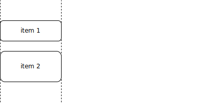

Layout expectations
===================

## General Concept
An expectation starts with `Expectations.expect(items)` where `items` may be a single item or multiple items. According to this choice there are different constraints that can be applied.

The number of items involved in such a constraint is stated in parentheses after the constraint name. These may be

- one item - (1)
- one item in relation to another - (2)
- multiple items in relation to each other - (*)

## Distances (2)

### At
`at()` allows to specify the relative position of two items.

Specify which distance you expect between two items.

    expect(textfield)
      .at().greater(5).pixels()
      .of(button);

Specify the horizontal direction you expect another item.

    expect(textfield)
      .at().left().about(10).pixels()
      .of(button);

Specify the vertical direction you expect another item.

    expect(textfield)
      .at().top().less(5).pixels()
      .of(button);

### Above and Below
`above()` and `below()` are shortcuts for `at().top()` and `at().bottom()` and thus specify the relative vertical position of two items.

Specify the vertical relation between two items.

    expect(caption)
      .above().between(10).and(20).pixels()
      .of(description);

    expect(description)
      .below().between(10).and(20).pixels()
      .of(caption);

### Right and Left
`left()` and `right()` are shortcuts for `at().left()` and `at().right()` and thus specify the relative horizontal position of two items.

Specify the horizontal relation between two items.

    expect(textfield)
      .left().about(10).pixels()
      .of(button);

    expect(button)
      .right().about(10).pixels()
      .of(textfield);

## Alignment (2, *)
`alignedHorizontally()` and `alignedVertically()` allows to specify the alignment of two items.

### Horizontal
`alignedHorizontally()` can be specified to align different edges
* `top()`
* `bottom()`
* `centered()`
* `all()`

Specify horizontal alignment at top and bottom (all) for all selected items.

    expect(item1, item2, item3)
      .alignedHorizontally().all()
      .withEachOther();

Specify horizontal alignment to the top line for all selected items.

    expect(item1, item2, item3)
      .alignedHorizontally().top()
      .withEachOther();

Specify horizontal alignment to the middle relative to another item.

    expect(item1)
      .alignedHorizontally().centered()
      .with(item2);

### Vertical
`alignedVertically()` can be specified to align different edges
* `right()`
* `left()`
* `centered()`
* `all()`

Specify vertical alignment to the left line for all selected items.

    expect(item1, item2, item3)
      .alignedVertically().left()
      .withEachOther();

Specify vertical alignment to left and right relative to another item.

    expect(item1)
      .alignedVertically().all()
      .with(item2);

Specify vertical alignment to the right line for all selected items and enforce equal distance.

    expect(item1, item2, item3)
      .alignedVertically().right()
      .equallyDistanced()
      .withEachOther();

## Containment (2)
`inside()`,`contains` and `overlaps` allow to specify the relative overlapping of two items.

### Inside
`inside()` specifies that the subject shape is inside the object shape

Specify the top offset of an inside object

    expect(button)
      .inside().about(20).pixels().top()
      .of(container);

### Contains
`inside()` specifies that the subject shape is containing the object shape

Specify the top offset of multiple contained objects

    expect(container)
      .contains().about(20).pixels().top()
      .items(item1, item2);

Specify the custom offsets of multiple contained objects

    expect(container)
      .contains()
      .about(20).pixels().top()
      .about(20).pixels().bottom()
      .about(10).pixels().left()
      .about(10).pixels().right()
      .items(item1, item2);

### Overlaps
`overlaps()` specifies that the subject shape is overlapping the object shape

Specify two objects overlapping

    expect(text)
      .overlaps().about(10).pixels().top()
      .with(image);

## Layers (2)

### Behind and InFront

## Size (1, 2)

### Height

### Width

## Visibility (1, *)

### Absent

### Visible

## Text (1)

### ...

## CSS Properties (1)

### ...

## Properties (1, *)

### Count

## Multi-Item Constraints

### Each

### Select

### Sorted

### Chunked

